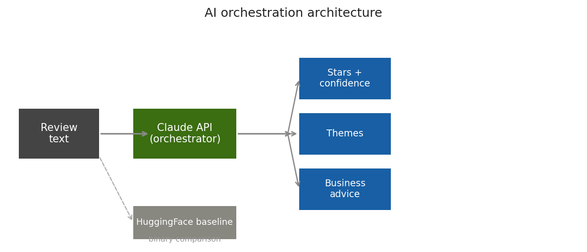
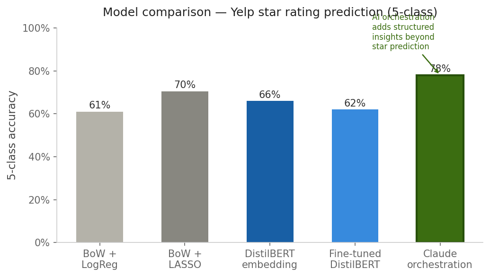
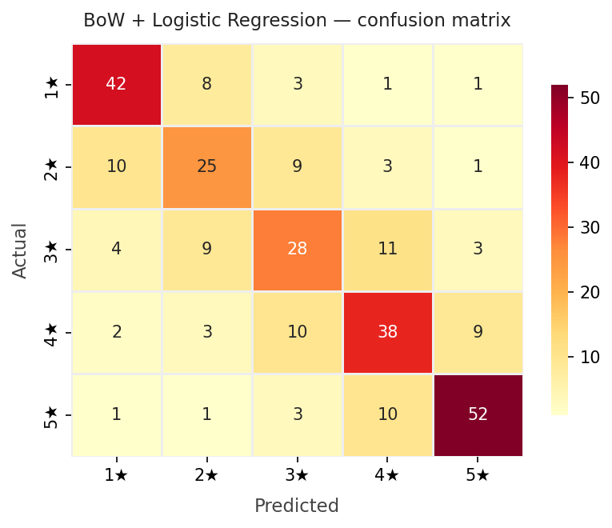

# AI Review Intelligence Dashboard

> Predict Yelp-style star ratings from customer reviews using **AI orchestration** — not just a classifier.


---

## What this project does

Most NLP tutorials stop at "train a logistic regression on TF-IDF features."
This project goes further: it uses **Claude as an AI orchestration layer** — a reasoning engine that reads a review and returns structured, multi-dimensional analysis that a traditional classifier fundamentally cannot produce.

| What you get | BoW classifier | distilbert | **This project (Claude)** |
|---|:---:|:---:|:---:|
| Star rating (1–5) | ✓ | ✗ (binary only) | ✓ |
| Confidence score | ✓ | ✓ | ✓ |
| Sentiment label | ✗ | ✓ | ✓ |
| Key themes (positive/negative/neutral) | ✗ | ✗ | ✓ |
| Star probability distribution | ✓ | ✗ | ✓ |
| Actionable business advice | ✗ | ✗ | ✓ |

---

## Architecture



**The orchestration pattern** is: instead of training a custom model, you use the LLM as intelligent middleware — feeding it unstructured text and prompting it to return a structured, typed JSON object. The app then renders that JSON into a user-facing dashboard.

```
Review text → Claude API (orchestrator) → structured JSON → Stars · Themes · Advice
                                                          ↘ HuggingFace (baseline comparison)
```

---

## Project structure

```
ai-review-intelligence/
│
├── app/
│   ├── __init__.py
│   ├── orchestrator.py      # Core AI orchestration class (ReviewOrchestrator)
│   └── streamlit_app.py     # Streamlit dashboard (single + batch mode)
│
├── data/
│   └── sample_reviews.csv   # Sample dataset (text, stars)
│
├── notebooks/
│   └── exploration.ipynb    # Model comparison walkthrough
│
├── tests/
│   └── test_orchestrator.py # Unit tests (8 tests, all passing)
│
├── assets/                  # Charts generated by the notebook
│
├── .env.example             # Template for environment variables
├── .gitignore
├── requirements.txt
└── README.md
```

---

## Quickstart

### 1. Clone the repo

```bash
git clone https://github.com/your-username/ai-review-intelligence.git
cd ai-review-intelligence
```

### 2. Create a virtual environment

```bash
python -m venv venv
source venv/bin/activate        # macOS / Linux
venv\Scripts\activate           # Windows
```

### 3. Install dependencies

```bash
pip install -r requirements.txt
```

> **Note:** `torch` and `transformers` are required for the HuggingFace baseline comparison. If you only want the Claude orchestration layer, you can skip them — the app degrades gracefully.

### 4. Set your API key

```bash
cp .env.example .env
# Then open .env and paste your Anthropic API key
```

Get a free API key at [console.anthropic.com](https://console.anthropic.com).

### 5. Run the dashboard

```bash
streamlit run app/streamlit_app.py
```

Open [http://localhost:8501](http://localhost:8501) in your browser.

---

## Usage

### Single review mode

Type or paste any customer review into the text box and click **Analyze with AI**. The dashboard displays:

- Predicted star rating with a ★ visual
- Confidence percentage
- Sentiment label (Positive / Negative / Mixed)
- Color-coded theme tags extracted from the review
- Star probability breakdown (horizontal bar chart)
- Actionable business insight

The HuggingFace baseline panel shows the same review processed by a traditional binary classifier — illustrating why AI orchestration adds value.

### Batch mode

Upload a CSV file with a `text` column. The dashboard will analyze up to 50 reviews, display a results table, show a rating distribution chart, and let you download the results as a CSV.

---

## Using the orchestrator in your own code

The `ReviewOrchestrator` class is a clean, importable module:

```python
from app.orchestrator import ReviewOrchestrator

orch = ReviewOrchestrator(api_key="sk-ant-...")

# Analyze a single review
result = orch.analyze("The food was amazing but the wait was too long.")

print(result.stars)        # 3
print(result.sentiment)    # "Mixed"
print(result.themes)       # [Theme(label="Food quality", type="positive"), ...]
print(result.advice)       # "Consider optimizing kitchen throughput…"

# Analyze a batch
reviews = ["Great!", "Terrible.", "Decent."]
results = orch.analyze_batch(reviews)

# Aggregate statistics
summary = orch.summarize_batch(results)
print(summary["average_stars"])           # 3.0
print(summary["sentiment_distribution"])  # {"Positive": 1, "Negative": 1, "Mixed": 1}
```

---

## Running the tests

```bash
pytest tests/ -v
```

```
tests/test_orchestrator.py::TestReviewAnalysis::test_from_dict_parses_correctly PASSED
tests/test_orchestrator.py::TestReviewAnalysis::test_to_dict_roundtrip PASSED
tests/test_orchestrator.py::TestReviewAnalysis::test_star_probs_are_ints PASSED
tests/test_orchestrator.py::TestReviewOrchestrator::test_analyze_returns_analysis PASSED
tests/test_orchestrator.py::TestReviewOrchestrator::test_analyze_strips_markdown_fences PASSED
tests/test_orchestrator.py::TestReviewOrchestrator::test_analyze_invalid_json_raises PASSED
tests/test_orchestrator.py::TestReviewOrchestrator::test_analyze_batch_returns_list PASSED
tests/test_orchestrator.py::TestReviewOrchestrator::test_summarize_batch PASSED

8 passed in 3.13s
```

Tests use mocked API responses — no real API calls are made during testing.

---

## Notebook walkthrough

Open `notebooks/exploration.ipynb` for a step-by-step comparison of all three approaches:

1. **Bag-of-Words + Logistic Regression** — TF-IDF vectorizer, sklearn pipeline
2. **HuggingFace distilbert** — pretrained transformer, zero-shot
3. **Claude API** — AI orchestration, structured JSON output

**Model comparison:**



**BoW confusion matrix:**



The notebook also generates all charts saved in `assets/`.

---

## Academic context

This project extends the work done in **Modern Data Mining (HW4)**, which covered:

- Text mining and document-term matrices
- Neural network architectures (Keras)
- BERT embeddings and HuggingFace transformers via `reticulate` in R
- Fine-tuning `distilbert-base-uncased` on Yelp data (5-class classification)
- Error analysis and confusion matrices

The key finding from that coursework: the embedding + LASSO model achieved ~70.5% accuracy, and fine-tuning distilbert achieved ~62%. This project takes a different approach — instead of fine-tuning, it uses **prompt engineering and AI orchestration** to get richer, more actionable output from the same underlying problem.

---

## Tech stack

| Component | Technology |
|---|---|
| AI orchestration | [Anthropic Claude API](https://anthropic.com) — `claude-sonnet-4-20250514` |
| Baseline comparison | [HuggingFace Transformers](https://huggingface.co) — `distilbert-base-uncased-finetuned-sst-2-english` |
| Dashboard | [Streamlit](https://streamlit.io) |
| ML baseline | scikit-learn (TF-IDF + Logistic Regression) |
| Visualization | matplotlib, seaborn |
| Testing | pytest |
| Language | Python 3.10+ |

---

## Roadmap

- [ ] Cloudflare Workers deployment for serverless API hosting
- [ ] Batch topic modeling — cluster common complaints across reviews
- [ ] Fine-tuning comparison — add a fine-tuned distilbert tab
- [ ] Multi-language support via Claude's multilingual capabilities
- [ ] Export to PDF report

---

## License

MIT License. See `LICENSE` for details.

---

## Author

Built as a portfolio project demonstrating AI orchestration patterns with the Anthropic Claude API and Hugging Face Transformers.
